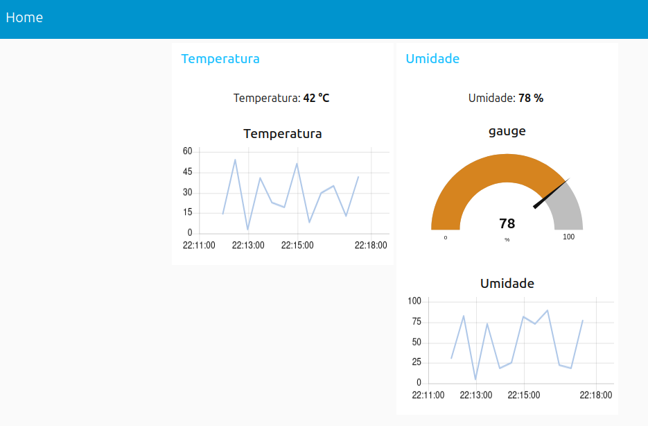
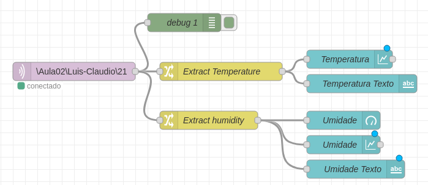
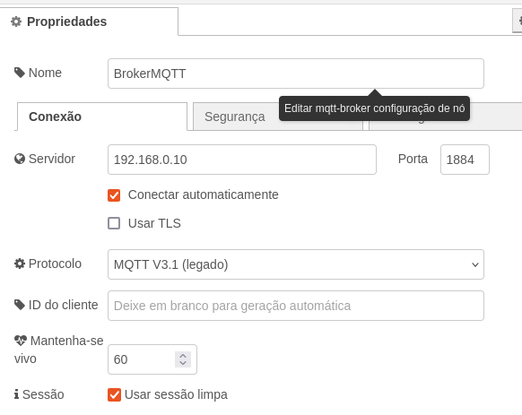
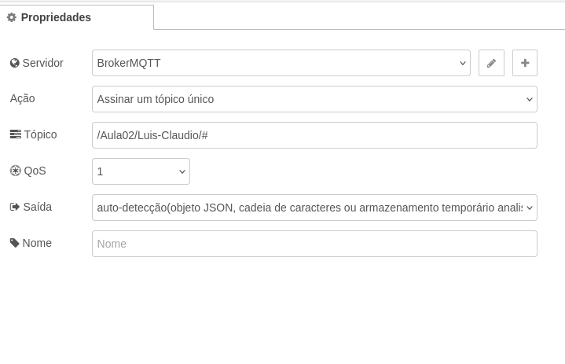
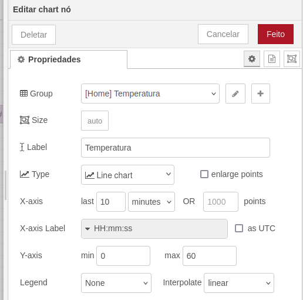
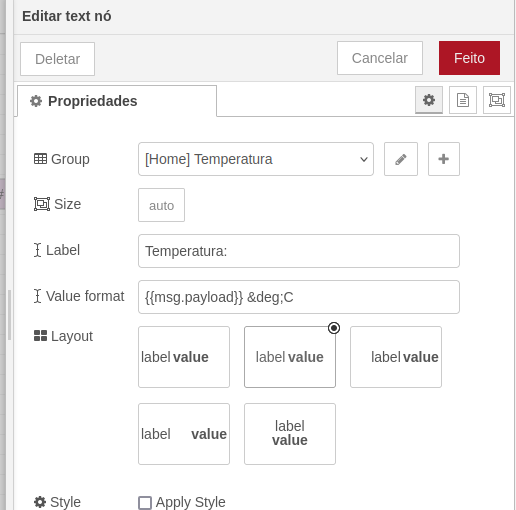
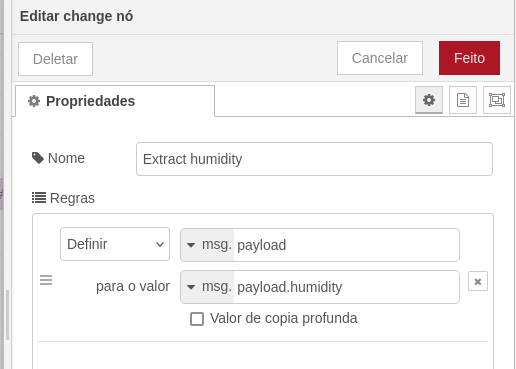
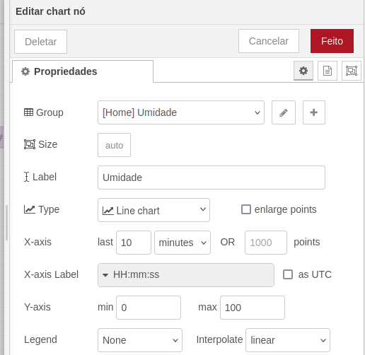
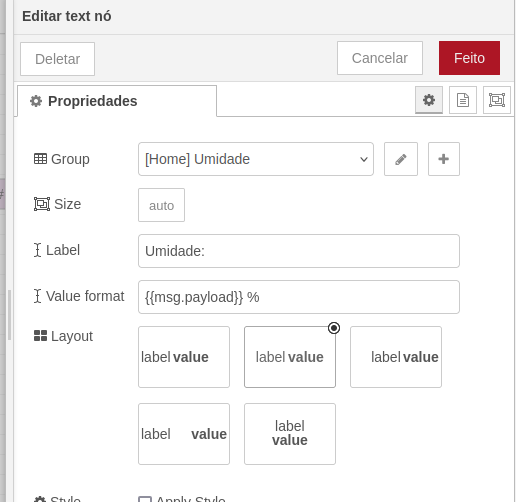
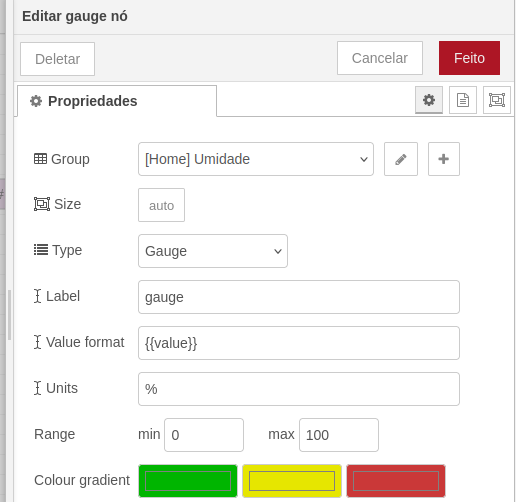

* Comandos uteis
```bash
    #Verifica satatus do servico
    systemctl status mosquitto
    #Finaliza o servico
    systemctl stop mosquitto
    #Inicia o servico
    systemctl start mosquitto
    #Reinicia o servico
    systemctl restart mosquitto

    #Testat o servico como Publisher
    mosquitto_pub -h 192.168.0.10 -p 1884  -u luis -P 123456 -t /topico -m mensagem
    #Testar o servico como Subscribe
    mosquitto_sub -h 192.168.0.10 -p 1884  -u luis -P 123456 -t /topico 

````

Sistema Operacional: Ubuntu 24.04 LTS


* Instalacao Mosquitto:
    ```bash
        sudo apt install mosquitto
    ```
* Configuracao Mosquitto:
    ```bash
        #Configura usuario e senha
        mosquitto_passwd -c /etc/mosquitto/passwd <nome_usuario>
        #Configurar usuario e senha 
        sudo nano /etc/mosquitto/conf.d/default.conf
        #Adicionar as linhas:
            #Altera a porta do servico do mosquitto porta padrao 1883
            listener 1884
            #Bloqueia o acesso sem autenticacao
            allow_anonymous false
            #Define arquivo onde estao armazenados os usuarios e senhas cadastrados usando o comando mosquitto-passwd
            password_file /etc/mosquitto/passwd
        #Reinicia o servico
        systemctl restart mosquitto
    ```
* Requisitos:
    - Configurar a VM para operar na mesma faixa de IP:
    - Instalar a biblioteca Paho MQTT - _pip install paho-mqtt_

* Instalar Node Red:
    ```bash
        bash <(curl -sL https://raw.githubusercontent.com/node-red/linux-installers/master/deb/update-nodejs-and-nodered)
        #Colocar o servico para rodar automaticamente
        node-red-pi --max-old-space-size=256

        #Acessar Node Red:
        http://192.168.0.10:1880
        #Acessar Dashboard:
        http://192.168.0.10:1880/ui
    ```
* Configuracao Node Red:
    
    
    
    
    
    
    
    
    
    
    
    
